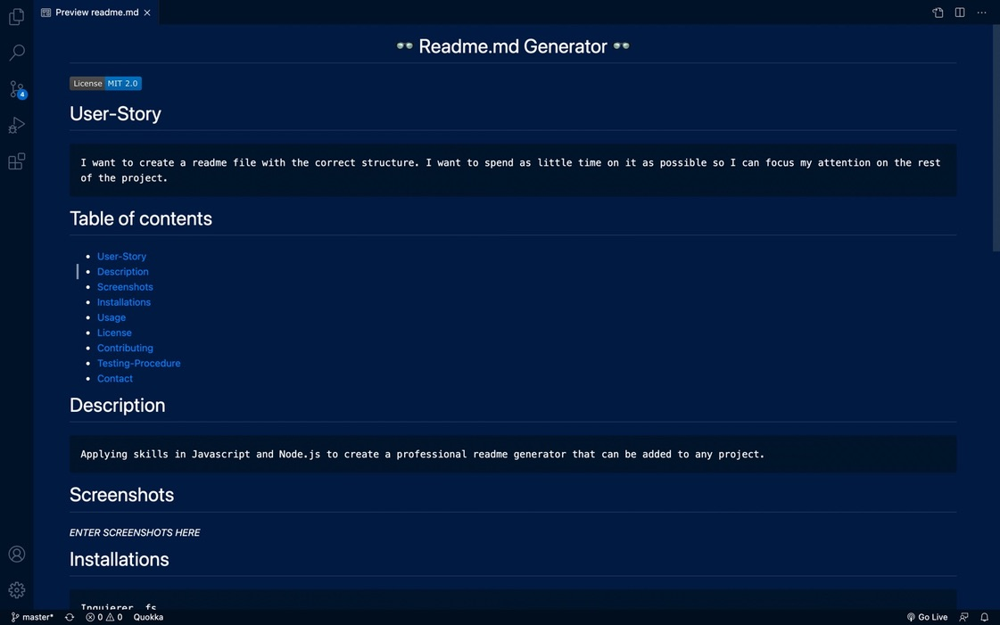

  <header align="center"> 
  <h1> 👓 Readme.md Generator 👓 </h1> 
  </header>

  
    

  # User-Story
    I want to create a readme file with the correct structure. I want to spend as little time on it as possible so I can focus my attention on the rest of the project.

  # Table of contents
  * [User-Story](#user-Story)
  * [Description](#Description)
  * [Screenshots](#Screenshots)
  * [Installations](#installations)
  * [Usage](#usage)
  * [License](#license)
  * [Contributing](#Contributing)
  * [Testing-Procedure](#Testing-Procedure)
  * [Contact](#contact)
    

  # Description
    Applying skills in Javascript and Node.js to create a professional readme generator that can be added to any project.

  # Screenshots and recordings
  

  # Installations
    Inquierer, fs

  # Usage
    Respond to prompts from the terminal after running the program.

  # Contributing
    Branch the project. Create a pull request when it is finished, including comments. Contact me.

  # Testing-Procedure
    NA

  # Contact
  If you would like to reach me in regards to either questions or comments, I am more than 
  happy to respond via github [Hayden-code](https://github.com/Hayden-code) or email [haychjones@gmail.com](haychjones@gmail.com).
    